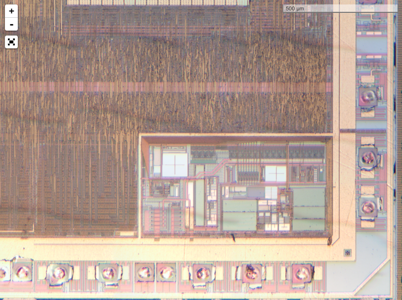

Leaflet.Nanoscale
=================

Leaflet.Nanoscale is a sub-millimeter scale control. It displays a scale in nanometers, micrometers or millimeters, calculating it from a known ratio of absolute pixels (i.e. pixels at maximum zoom) to nanometers.

Screenshot
----------



Usage
-----

Include the script:

``` html
<script type="text/javascript" src="vendor/leaflet.nanoscale/Control.Nanoscale.js"></script>
```

Add the control to the map:

``` javascript
L.control.nanoscale({
  nanometersPerPixel: scale,
}).addTo(map);
```

Options
-------

| Option             | Type    | Default      | Description |
| ------------------ | ------- | -------------| ----------- |
| nanometersPerPixel | Number  | 1000         | The ratio between pixels at maximum zoom and nanometers |
| position           | String  | 'bottomleft' | The position of the control (one of the map corners). See [control positions](http://leafletjs.com/reference.html#control-positions). |
| maxWidth           | Number  | 100          | Maximum width of the control in pixels. The width is set dynamically to show round values (e.g. 100, 200, 500). |
| updateWhenIdle     | Boolean | false        | If true, the control is updated on moveend, otherwise it's always up-to-date (updated on move). |

License
-------

[MIT license](LICENSE.txt)
